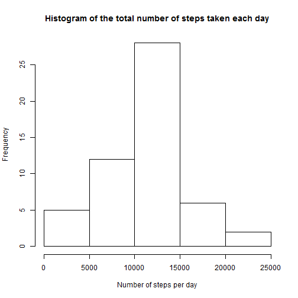
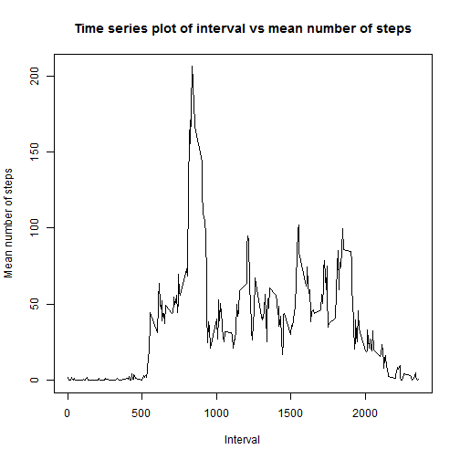
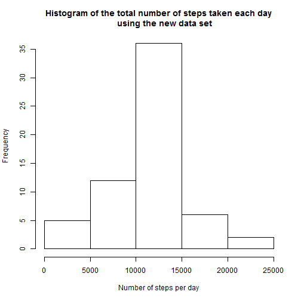
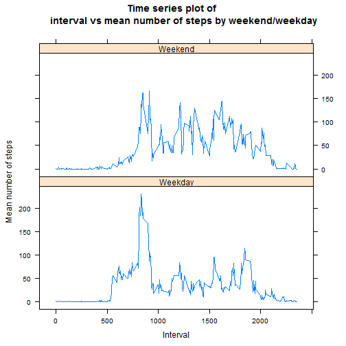

# Reproducible Research: Peer Assessment 1

This documents creates the submission for the Coursera Reporducible Research Peer Assessment 1. 

## Loading and preprocessing the data
To load the data from **Activity.zip** file, included with the original repository:

```r
unzip(zipfile = "activity.zip")
originaldata = read.csv(file = "activity.csv")
```


This imports 17,568 observations of: **steps**, **date**, **interval**. The six number summary of the data is:

```r
summary(originaldata)
```

```
##      steps               date          interval   
##  Min.   :  0.0   2012-10-01:  288   Min.   :   0  
##  1st Qu.:  0.0   2012-10-02:  288   1st Qu.: 589  
##  Median :  0.0   2012-10-03:  288   Median :1178  
##  Mean   : 37.4   2012-10-04:  288   Mean   :1178  
##  3rd Qu.: 12.0   2012-10-05:  288   3rd Qu.:1766  
##  Max.   :806.0   2012-10-06:  288   Max.   :2355  
##  NA's   :2304    (Other)   :15840
```


## What is mean total number of steps taken per day?

The instruction asks for a histogram of the total number of steps taken each day, ignoring missing values.
We sum across each day using:

```r
summed = aggregate(steps ~ date, originaldata, FUN = sum, na.action = na.omit)
```

and create the histogram:

```r
hist(summed$steps, xlab = "Number of steps per day", main = "Histogram of the total number of steps taken each day")
```

 

The data has the mean and median:

```r
mean(summed$steps)
```

```
## [1] 10766
```

```r
median(summed$steps)
```

```
## [1] 10765
```


## What is the average daily activity pattern?

The instruction is to make a time series plot of the 5-minute interval and the average number of steps taken (across all days).
We aggregate the data to create one row per **interval** and use the argument "FUN=mean" to average the data:

```r
interval_mean = aggregate(steps ~ interval, originaldata, FUN = mean)
```


The plot is created with:

```r
plot(x = interval_mean$interval, y = interval_mean$steps, type = "l", xlab = "Interval", 
    ylab = "Mean number of steps", main = "Time series plot of interval vs mean number of steps")
```

 


The row with the maximum value is:

```r
interval_mean[which.max(interval_mean$steps), ]
```

```
##     interval steps
## 104      835 206.2
```


## Imputing missing values

The number of NAs (=2304) can be seen in the six number summary

```r
summary(originaldata)
```

```
##      steps               date          interval   
##  Min.   :  0.0   2012-10-01:  288   Min.   :   0  
##  1st Qu.:  0.0   2012-10-02:  288   1st Qu.: 589  
##  Median :  0.0   2012-10-03:  288   Median :1178  
##  Mean   : 37.4   2012-10-04:  288   Mean   :1178  
##  3rd Qu.: 12.0   2012-10-05:  288   3rd Qu.:1766  
##  Max.   :806.0   2012-10-06:  288   Max.   :2355  
##  NA's   :2304    (Other)   :15840
```


The strategy to create a new dataset used here is to replace the missing values with the average for that 5-minute interval using partial matching of the exactly repeating pattern of the 5-minute interval column:

```r
newdata = originaldata
newdata[is.na(originaldata)] = interval_mean$step
```

```
## Warning: Name partially matched in data frame
```


The histogram of the new data is created by:

```r
newsummed = aggregate(steps ~ date, newdata, FUN = sum)
hist(newsummed$steps, xlab = "Number of steps per day", main = "Histogram of the total number of steps taken each day\n     using the new data set")
```

 


With the new mean and medians as:

```r
mean(newsummed$steps)
```

```
## [1] 10766
```

```r
median(newsummed$steps)
```

```
## [1] 10766
```

The mean is the same as the original value to the nearest integer, the median is now 1 higher.

The histograms look different, with a higher peak on the new data set. Since we copied mean values for missing intervals we have made it more frequent without changing the frequency of the other values. The total number of observations for the new data set is 61 as opposed to 53 observations for the original data with NAs removed.

## Are there differences in activity patterns between weekdays and weekends?

The instructions ask for a two factor variable to be created, to identify if the **date** is a weekend (Sat/Sun) or weekday (Mon-Fri). We use the weekdays function and assess for each **date** the truth of whether it is Saturday or Sunday - if so, it is a weekend, if not it is a weekday:

```r
datadays = weekdays(as.Date(newdata$date))
satsun = datadays == "Saturday" | datadays == "Sunday"
datadays[satsun] = "Weekend"
datadays[!satsun] = "Weekday"
daytype = as.factor(datadays)
newdata_daytype = cbind(newdata, daytype)
```


The new panel plots need the **steps** averaged by **interval** for both values of the factor values "Weekend"/"Weekday":


```r
interval_daytype_mean = aggregate(steps ~ interval + daytype, newdata_daytype, 
    FUN = mean)
require(lattice)
```

```
## Loading required package: lattice
```

```r
xyplot(steps ~ interval | daytype, interval_daytype_mean, type = "l", layout = c(1, 
    2), xlab = "Interval", ylab = "Mean number of steps", main = "Time series plot of \n        interval vs mean number of steps by weekend/weekday")
```

 


